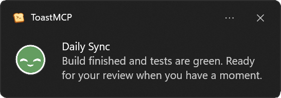

#  ToastMCP

I made ToastMCP so **you** can hear and see your assistants when it matters. It’s for the moment a task finishes, or when an agent is stuck waiting on your input. It lets agents be **expressive**—not just functional—so you get clear, human signals instead of silent stalls. The best part: it’s **infinitely customizable**. Drop in new sounds and icons and the vocabulary expands instantly.

ToastMCP is Windows-only for now.



##  What it does
- **`notify`**: gives your coding agents a way to reach you beyond the terminal. They choose the title, message, sound, and icon—so the tone fits the moment, not just the status. The tool exposes every asset you add, so agents can use them creatively.

##  Install (ZIP)
1. Download the latest release ZIP [here](https://github.com/Artificial-Sweetener/ToastMCP/releases/latest).
2. Extract it to a folder that contains:
   - `toastmcp.exe`
   - `sounds/`
   - `icons/`
   - `res/`
3. Point your MCP client config to the extracted `toastmcp.exe`.

##  Example MCP config
```json
{
  "mcpServers": {
    "toastmcp": {
      "command": "C:\\path\\to\\toastmcp.exe"
    }
  }
}
```

##  Example tool call (agent‑side)
```json
{
  "name": "notify",
  "arguments": {
    "title": "Build complete",
    "message": "Everything finished successfully.",
    "sound": "success",
    "icon": "proud"
  }
}
```

##  Sounds and icons
Drop your assets in these folders:
- `sounds/` (WAV files)
- `icons/` (PNG files)
- `res/` (app icon resources)

ToastMCP does **not** ship with sounds. That’s on purpose. You can supply your own, or let it fall back to Windows system sounds.

ToastMCP reports **every** `.wav` and `.png` it finds (ignores `backup/` folders).
Use the filename (without extension) as the `sound` or `icon` id.
For naming and format tips, see:
- `icons/icons.txt`
- `sounds/sounds.txt`

This is the magic: **anything you name becomes part of the agent’s expressive vocabulary**.
Name your icons and sounds well, and agents will reach for them naturally—often in surprising ways.

If `sounds/` is empty, ToastMCP falls back to **Windows system sounds** and exposes those ids instead.

##  Build
```bash
cargo build
```

Package a release ZIP (includes `toastmcp.exe`, `icons/`, `res/`):
```powershell
.\package.ps1
```

##  License & Philosophy

ToastMCP is **Free and Open Source Software (FOSS)**, distributed under the **GNU GPL v3.0**.

I believe software should be free. If you improve ToastMCP, pass those improvements forward.

##  From the Developer 💖

I hope ToastMCP makes your agents feel more alive and your workflow a little more human.

- **Buy Me a Coffee**: You can help fuel more projects like this at my [Ko-fi page](https://ko-fi.com/artificial_sweetener).
- **My Website & Socials**: See my art, poetry, and other dev updates at [artificialsweetener.ai](https://artificialsweetener.ai).
- **If you like this project**, it would mean a lot to me if you gave me a star here on Github!! ⭐

